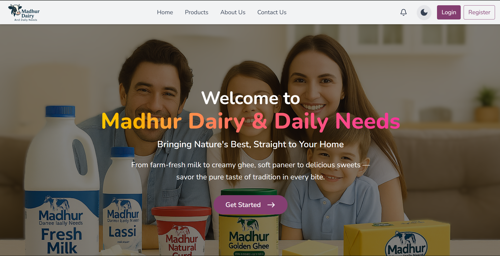
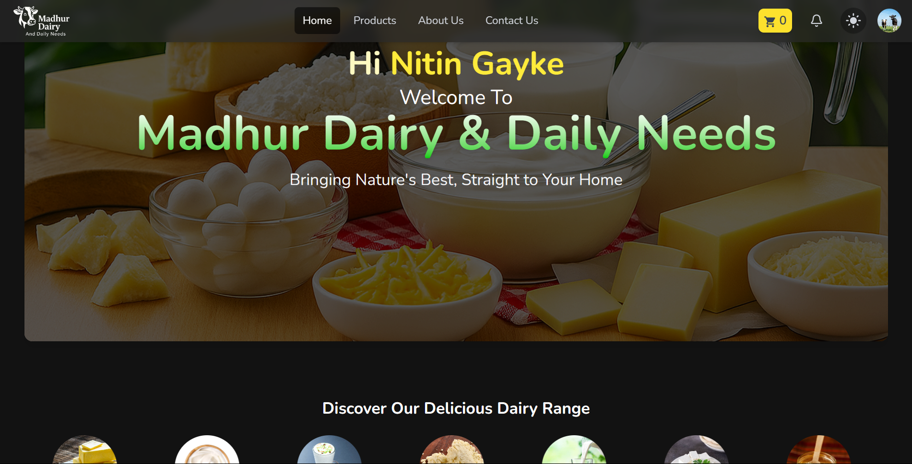
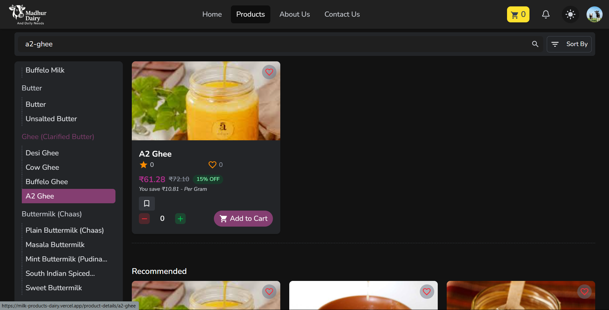
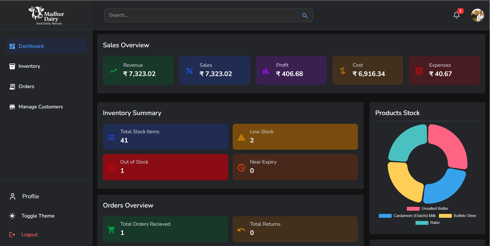
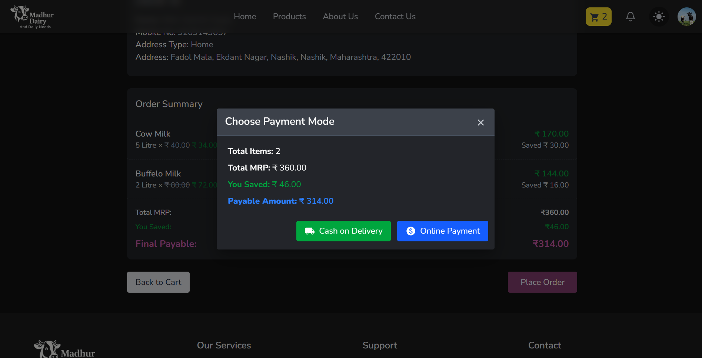
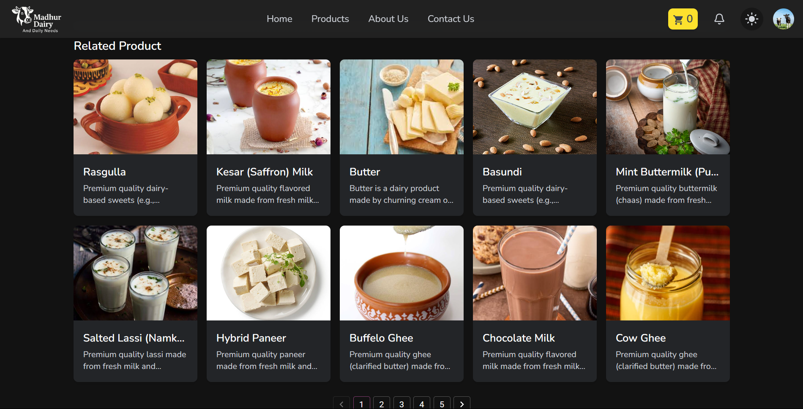
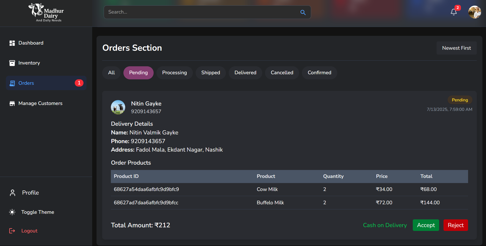

# Madhur Dairy & Daily Needs – Real-Time MERN Stack Based Dairy Products Platform 





## 📌 About the Project

**Madhur Dairy** is a full-featured dairy product selling platform built using the **MERN Stack** (MongoDB, Express.js, React.js, Node.js). It includes secure authentication, real-time ordering, online payments, product reviews, admin management, and more.

> ⚙️ Simulates a real-world e-commerce system with deep integration of modern tools like Socket.IO, EmailJS, Google OAuth, Cloudinary, and Razorpay.

---

## 🔧 Tech Stack

### 🖥️ Frontend (React + Vite)
- React.js, Vite
- Tailwind CSS, Material UI
- Chart.js (Admin analytics)
- EmailJS (OTP)
- Google OAuth
- Razorpay (Test)
- Cloudinary
- Fully Responsive

### ⚙️ Backend (Node.js + Express)
- Express + Node.js
- MongoDB + Mongoose
- JWT & bcryptjs Auth
- Socket.IO (real-time)
- Modular REST APIs

---

## 🛒 Core Features

### 👤 User Side
- Register/Login (Google or Email)
- OTP verification via EmailJS
- Browse & filter products
- Cart management
- Place real-time orders
- Live notifications (order status)
- Reviews and ratings
- Razorpay or COD payment
- View order history and profile

### 🛠️ Admin Panel
- Real-time admin dashboard
- Accept/Reject orders
- Manage inventory (CRUD)
- Analytics with Chart.js
- Customer reviews handling
- Notifications for new/canceled orders

---

## 🌐 Hosted Links

- 🚀 **Frontend**: [https://milk-products-dairy-kappa.vercel.app/](https://milk-products-dairy-kappa.vercel.app/)
- 🌐 **Backend**: [https://madhur-dairy-daily-need-server-1eu6.onrender.com](https://madhur-dairy-daily-need-server-1eu6.onrender.com)

---

##  Installation Guide (Local Setup)

>  Follow these steps to run the project on your local machine


### 1. Clone the repository
Clones the full stack repo to your system.

```bash
git clone https://github.com/nitingayke/MilkProductsDairy.git
```

### 2. Move to the Project Directory
Navigate into the main project folder.

```bash
cd MilkProductsDairy
```

### 3. Set Up the Client (Frontend) 
Navigate to the Client directory.
```bash
cd Client
```

Install all required frontend dependencies.
```bash
npm install
```

Start the frontend development server.
```bash
npm run dev
```


#### 4. Create Environment File for Client
```env
VITE_EMAILJS_SERVICE_ID=<your_emailjs_service_id>
VITE_EMAILJS_TEMPLATE_ID=<your_emailjs_template_id>
VITE_EMAILJS_PUBLIC_KEY=<your_emailjs_public_key>
```

### 5. Set Up the Server (Backend)
Open a new terminal and navigate to the server folder.
```bash
cd Server
```

Install all backend dependencies.
```bash
npm install
```

Start the backend development server.
```bash
nodemon
```

### 6. Create Environment File for Server
```env
DB_URL=<your_mongodb_uri>
CLOUDINARY_CLOUD_NAME=<your_cloud_name>
CLOUDINARY_API_KEY=<your_api_key>
CLOUDINARY_API_SECRET=<your_api_secret>
RAZORPAY_KEY_ID=<your_razorpay_key>
RAZORPAY_KEY_SECRET=<your_razorpay_secret>
GOOGLE_CLIENT_ID=<your_google_oauth_client_id>
```

---

## 📸 Screenshots & UI Preview

| Homepage | Product Page | Admin Dashboard |
|----------|--------------|-----------------|
|  |  |  |

| Payment | Related Products | Admin Profile |
|--------|----------------|----------------|
|  |  |  |


>  This project reflects real-world collaboration, planning, and execution — from designing the UI to deploying on production servers. Proudly built with

---

##  Connect With Me
If you're working on something similar, have questions, or want to collaborate, feel free to connect! I’d love to hear from you. 🚀

-  [LinkedIn](https://www.linkedin.com/in/nitin-gayke92/)
-  [Portfolio](https://nitin-portfolio-gilt.vercel.app/)
-  [Email](mailto:gaykenitin975@gmail.com)
  
